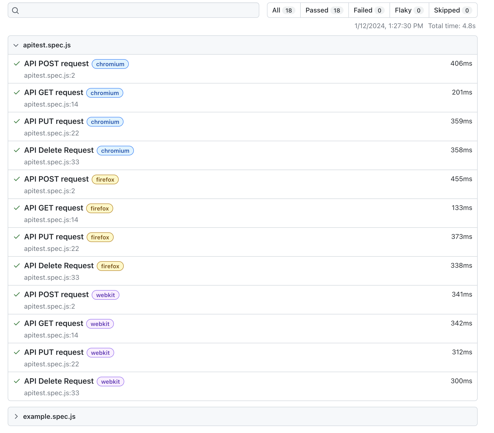

# Project Title

Using PlayWright for API Automation testing.

## Description

PlayWright is an open source project released by Mircosoft which is built on top of Puppeteer, a node.js library framework for headless chrome testing .

## Getting Started

### Dependencies

* npm, node

### Installing

* To install playwright, run ```npm init playwright@latest``` and follow the prompts to finish installation.

### Executing program

* To run the default tests under "tests" folder, run
```
npx playwright test
```
* To run the tests in UI
```
npx playwright test --ui
```
* To run the default tests under "tests" folder, run
```
npx playwright show-report
```

## Help

While running tests with UI option, navigate to errors tab to view the error and network to view request and response

## Acknowledgments

Inspiration
* [Playwright API Testing demo](https://www.youtube.com/watch?v=EEjyLfp6DoQ)
* [Playwright docs](https://playwright.dev/docs)
* [reqres] (https://reqres.in/)

